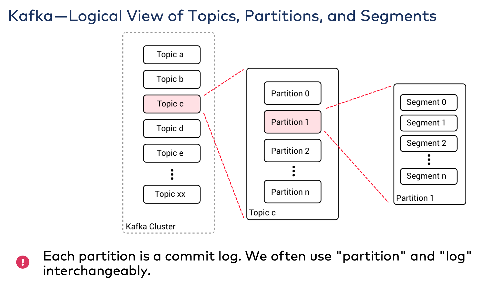
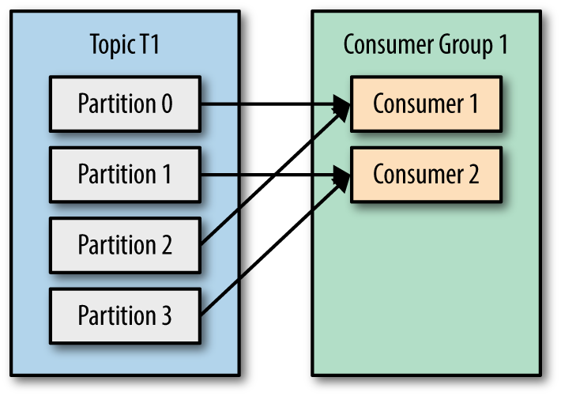
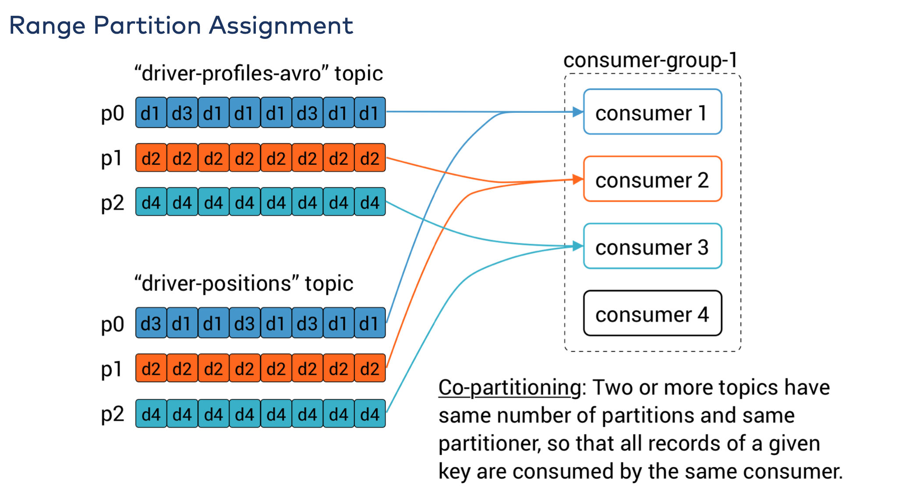
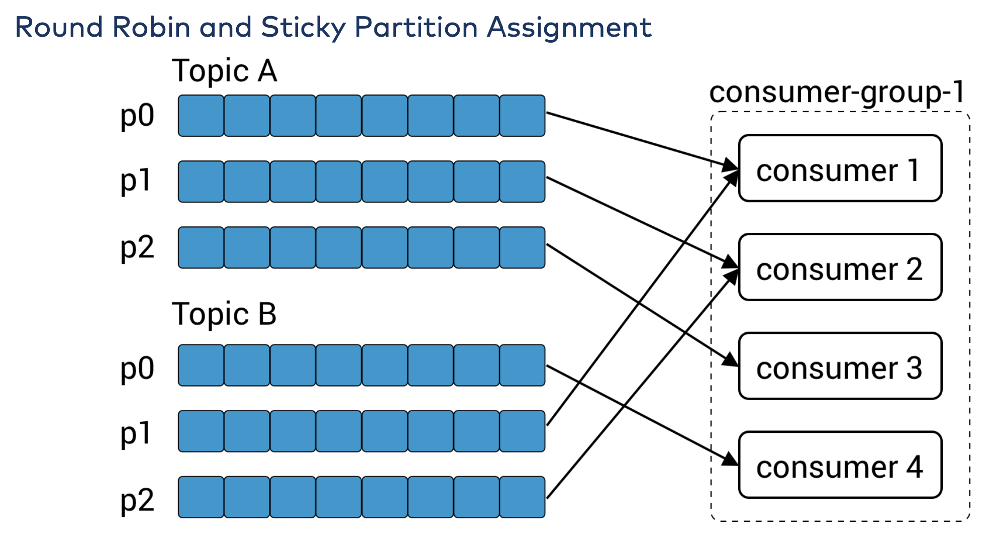

# Notes on kafka

## Why kafka

* **Multiple Producers**: Kafka is able to seamlessly handle multiple producers, whether those clients are using many
  topics or the same topic. This makes the system ideal for aggregating data from many frontend systems and making it
  consistent. For example, a site that serves content to users via a number of microservices can have a single topic for
  page views that all services can write to using a common format. Consumer applications can then receive a single
  stream of page views for all applications on the site without having to coordinate consuming from multiple topics, one
  for each application.
* **Multiple Consumers**: In addition to multiple producers, Kafka is designed for multiple consumers to read any single
  stream of messages without interfering with each other. This is in contrast to many queuing systems where once a
  message is consumed by one client, it is not available to any other. Multiple Kafka consumers can choose to operate as
  part of a group and share a stream, assuring that the entire group processes a given message only once.
* **Disk-Based Retention**: Not only can Kafka handle multiple consumers, but durable message retention means that
  consumers do not always need to work in real time. Messages are committed to disk, and will be stored with
  configurable retention rules. These options can be selected on a per-topic basis, allowing for different streams of
  messages to have different amounts of retention depending on the consumer needs. Durable retention means that if a
  consumer falls behind, either due to slow processing or a burst in traffic, there is no danger of losing data. It also
  means that maintenance can be performed on consumers, taking applications offline for a short period of time, with no
  concern about messages backing up on the producer or getting lost. Consumers can be stopped, and the messages will be
  retained in Kafka. This allows them to restart and pick up processing messages where they left off with no data loss.
* **Scalable**: Kafka’s flexible scalability makes it easy to handle any amount of data. Users can start with a single
  broker as a proof of concept, expand to a small development cluster of three brokers, and move into production with a
  larger cluster of tens or even hundreds of brokers that grows over time as the data scales up. Expansions can be
  performed while the cluster is online, with no impact on the availability of the system as a whole. This also means
  that a cluster of multiple brokers can handle the failure of an individual broker, and continue servicing clients.
* **High performance**: All of these features come together to make Apache Kafka a publish/subscribe messaging system
  with excellent performance under high load. Producers, consumers, and brokers can all be scaled out to handle very
  large message streams with ease. This can be done while still providing sub second message latency from producing a
  message to availability to consumers.

## Broker Configuration

* **broker.id**
* **port**
* **zookeeper.connect**: The location of the Zookeeper used for storing the broker metadata is set using the
  `zookeeper.connect` configuration parameter. The example configuration uses a Zookeeper running on port 2181 on the
  local host, which is specified as localhost:2181. The format for this parameter is a semicolon-separated list of
  hostname:port/path strings
* **log.dirs**: Kafka persists all messages to disk, and these log segments are stored in the directories specified in
  the log.dirs configuration. This is a comma-separated list of paths on the local system. If more than one path is
  specified, the broker will store partitions on them in a “least-used” fashion with one partition’s log segments stored
  within the same path.
* **num.recovery.threads.per.data.dir**: Kafka uses a configurable pool of threads for handling log segments. Currently,
  this thread pool is used:
    * When starting normally, to open each partition’s log segments
    * When starting after a failure, to check and truncate each partition’s log segments
    * When shutting down, to cleanly close log segments
* auto.create.topics.enable

### Topic Defaults

The Kafka server configuration specifies many default configurations for topics that are created. Several of these
parameters, including partition counts and message retention, can be set per-topic



* **num.partitions**: The `num.partitions` parameter determines how many partitions a new topic is created with,
  primarily when automatic topic creation is enabled (which is the default setting). This parameter defaults to one
  partition. Keep in mind that the number of partitions for a topic can only be increased, never decreased.
* **log.retention.ms**: The most common configuration for how long Kafka will retain messages is by time. The default is
  specified in the configuration file using the `log.retention.hours` parameter, and it is set to 168 hours, or one
  week. However, there are two other parameters allowed, `log.retention.minutes` and `log.retention.ms`. All three of
  these specify the same configuration—the amount of time after which messages may be deleted—but the recommended
  parameter to use is `log.retention.ms`, **as the smaller unit size will take precedence if more than one is
  specified**. This will make sure that the value set for `log.retention.ms` is always the one used. If more than one is
  specified, the smaller unit size will take precedence.
* **log.retention.bytes**: Another way to expire messages is based on the total number of bytes of messages retained.
  This value is set using the `log.retention.bytes` parameter, and it is applied per-partition. This means that if you
  have a topic with 8 partitions, and `log.retention.bytes` is set to 1 GB, the amount of data retained for the topic
  will be 8 GB at most. Note that all retention is performed for individual partitions, not the topic. If you have
  specified a value for both `log.retention.bytes` and `log.retention.ms` (or another parameter for retention by time),
  messages **may be removed when either criteria are met**.
* **log.segment.bytes**:: The log-retention settings previously mentioned operate on log segments, not individual
  messages. As messages are produced to the Kafka broker, they are appended to the current log segment for the
  partition. Once the log segment has reached the size specified by the `log.segment.bytes` parameter, which defaults to
  1 GB, the log segment is closed and a new one is opened. Once a log segment has been closed, it can be considered for
  expiration. Note that **messages cannot be expired until the log segment is closed**
* **log.segment.ms**: Another way to control when log segments are closed is by using the `log.segment.ms` parameter,
  which specifies the amount of time after which a log segment should be closed. As with the `log.retention.bytes`
  and `log.retention.ms` parameters, `log.segment.bytes` and `log.segment.ms` are not mutually exclusive properties.
  Kafka will close a log segment either when the size limit is reached or when the time limit is reached, **whichever
  comes first**.
* **message.max.bytes**: The Kafka broker limits the maximum size of a message that can be produced, configured by the
  message.max.bytes parameter, which defaults to 1000000, or 1 MB. A producer that tries to send a message larger than
  this will receive an error back from the broker, and the message will not be accepted. As with all byte sizes
  specified on the broker, this configuration deals with compressed message size.

#### NOTE: HOW TO CHOOSE THE NUMBER OF PARTITIONS

There are several factors to consider when choosing the number of partitions:

* What is the throughput you expect to achieve for the topic? For example, do you expect to write 100 KB per second or 1
  GB per second?
* What is the maximum throughput you expect to achieve when consuming from a single partition? A partition will always
  be consumed completely by a single consumer (as even when not using consumer groups, the consumer must read all
  messages in the partition). If you know that your slower consumer writes the data to a database and this database
  never handles more than 50 MB per second from each thread writing to it, then you know you are limited to 50 MB/sec
  throughput when consuming from a partition.
* You can go through the same exercise to estimate the maximum throughput per producer for a single partition, but since
  producers are typically much faster than consumers, it is usually safe to skip this.
* If you are sending messages to partitions based on keys, adding partitions later can be very challenging, so calculate
  throughput based on your expected future usage, not the current usage.
* Consider the number of partitions you will place on each broker and available diskspace and network bandwidth per
  broker.
* Avoid overestimating, as each partition uses memory and other resources on the broker and will increase the time for
  leader elections.

With all this in mind, it’s clear that you want many partitions but not too many. If you have some estimate regarding
the target throughput of the topic and the expected throughput of the consumers, you can divide the target throughput by
the expected consumer throughput and derive the number of partitions this way. So if I want to be able to write and read
1 GB/sec from a topic, and I know each consumer can only process 50 MB/s, then I know I need at least 20 partitions.
This way, I can have 20 consumers reading from the topic and achieve 1 GB/sec.

## Producer configuration


### Mandatory properties

* **bootstrap.servers**: List of host:port pairs of brokers that the producer will use to establish initial connection to the Kafka cluster. This list does not need to include all brokers, since the producer will get more information after the initial connection. But it is recommended to include at least two, so in case one broker goes down, the producer will still be able to connect to the cluster.
* **key.serializer**: Name of a class that will be used to serialize the keys of the records we will produce to Kafka. Kafka brokers expect byte arrays as keys and values of messages. However, the producer interface allows, using parameterized types, any Java object to be sent as a key and value. This makes for very readable code, but it also means that the producer has to know how to convert these objects to byte arrays.
* **value.serializer**: Name of a class that will be used to serialize the values of the records we will produce to Kafka.

```scala
val props:Properties=new Properties()
props.setProperty(ProducerConfig.BOOTSTRAP_SERVERS_CONFIG,"localhost:9092")
props.setProperty(ProducerConfig.KEY_SERIALIZER_CLASS_CONFIG,classTag[StringSerializer].runtimeClass.getCanonicalName)
props.setProperty(ProducerConfig.VALUE_SERIALIZER_CLASS_CONFIG,classTag[StringSerializer].runtimeClass.getCanonicalName)
val kafkaProducer = new KafkaProducer[String, String](props)
```

### Other configuration properties

[Here](http://kafka.apache.org/documentation.html#producerconfigs) il complete list of all configuration properties

 * **acks**: The `acks` parameter controls how many partition replicas must receive the record before the producer can consider the write successful. This option has a significant impact on how likely messages are to be lost. There are three allowed values for the `acks` parameter:
   * If `acks=0`, the producer will not wait for a reply from the broker before assuming the message was sent successfully. This means that if something went wrong and the broker did not receive the message, the producer will not know about it and the message will be lost. However, because the producer is not waiting for any response from the server, it can send messages as fast as the network will support, so this setting can be used to achieve very high throughput.
   * if `acks=1`, the producer will receive a success response from the broker the moment the leader replica received the message. If the message can’t be written to the leader (e.g., if the leader crashed and a new leader was not elected yet), the producer will receive an error response and can retry sending the message, avoiding potential loss of data. The message can still get lost if the leader crashes and a replica without this message gets elected as the new leader (via unclean leader election).
   * If `acks=all`, the producer will receive a success response from the broker once all [in-sync replicas received the message](https://accu.org/journals/overload/28/159/kozlovski/). This is the safest mode since you can make sure more than one broker has the message and that the message will survive even in the case of crash 
 * **buffer.memory**: This sets the amount of memory the producer will use to buffer messages waiting to be sent to brokers. If messages are sent by the application faster than they can be delivered to the server, the producer may run out of space and additional send() calls will either block or throw an exception, based on the `max.block.ms`
 * **compression.type**: By default, messages are sent uncompressed. This parameter can be set to `snappy`, `gzip`, or `lz4`, in which case the corresponding compression algorithms will be used to compress the data before sending it to the brokers.
   * **Snappy**: compression was invented by Google to provide decent compression ratios with low CPU overhead and good performance, so it is recommended in cases where both performance and bandwidth are a concern.
   * **Gzip**: compression will typically use more CPU and time but results in better compression ratios, so it is recommended in cases where network bandwidth is more restricted.
 * **retries**: When the producer receives an error message from the server, the error could be transient (e.g., a lack of leader for a partition). In this case, the value of the `retries` parameter will control how many times the producer will retry sending the message before giving up and notifying the client of an issue. By default, the producer will wait 100ms between retries, but you can control this using the `retry.backoff.ms parameter`.
 * **batch.size**: When multiple records are sent to the same partition, the producer will batch them together. This parameter controls the amount of memory in bytes (not messages!) that will be used for each batch. When the batch is full, all the messages in the batch will be sent. However, this does not mean that the producer will wait for the batch to become full. The producer will send half-full batches and even batches with just a single message in them. Therefore, setting the batch size too large will not cause delays in sending messages; it will just use more memory for the batches.
 * **linger.ms**: `linger.ms` controls the amount of time to wait for additional messages before sending the current batch. KafkaProducer sends a batch of messages either when the current batch is full or when the `linger.ms` limit is reached. By default, the producer will send messages as soon as there is a sender thread available to send them, even if there’s just one message in the batch. By setting `linger.ms` higher than 0, we instruct the producer to wait a few milliseconds to add additional messages to the batch before sending it to the brokers. This increases latency but also increases throughput (because we send more messages at once, there is less overhead per message).
 * **client.id**: This can be any string, and will be used by the brokers to identify messages sent from the client. It is used in logging and metrics, and for quotas.
 * **max.in.flight.requests.per.connection**: This controls how many messages the producer will send to the server without receiving responses. Setting this high can increase memory usage while improving throughput, but setting it too high can reduce throughput as batching becomes less efficient. Setting this to 1 will guarantee that messages will be written to the broker in the order in which they were sent, even when retries occur.

Setting the `retries` parameter to nonzero and the `max.in.flight.requests.per.connection` to more than one means that it is possible that the broker will fail to write the first batch of messages, succeed to write the second (which was already in-flight), and then retry the first batch and succeed, thereby reversing the order.
Usually, setting the number of retries to zero is not an option in a reliable system, so if guaranteeing order is critical, we recommend setting `in.flight.requests.per.session=1` to make sure that while a batch of messages is retrying, additional messages will not be sent (because this has the potential to reverse the correct order). This will severely limit the throughput of the producer, so only use this when order is important.

 * **timeout.ms**, **request.timeout.ms**, and **metadata.fetch.timeout.ms**: These parameters control how long the producer will wait for a reply from the server when sending data (`request.timeout.ms`) and when requesting metadata such as the current leaders for the partitions we are writing to (`metadata.fetch.timeout.ms`). If the timeout is reached without reply, the producer will either retry sending or respond with an error (either through exception or the send callback). `timeout.ms` controls the time the broker will wait for in-sync replicas to acknowledge the message in order to meet the acks configuration—the broker will return an error if the time elapses without the necessary acknowledgments.
 * **max.block.ms**: This parameter controls how long the producer will block when calling send() and when explicitly requesting metadata via partitionsFor(). Those methods block when the producer’s send buffer is full or when metadata is not available. When `max.block.ms` is reached, a timeout exception is thrown.
 * **max.request.size**: This setting controls the size of a produce request sent by the producer. It caps both the size of the largest message that can be sent and the number of messages that the producer can send in one request. For example, with a default maximum request size of 1 MB, the largest message you can send is 1 MB or the producer can batch 1,024 messages of size 1 KB each into one request. In addition, the broker has its own limit on the size of the largest message it will accept (message.max.bytes). It is usually a good idea to have these configurations match, so the producer will not attempt to send messages of a size that will be rejected by the broker.
 * **receive.buffer.bytes** and **send.buffer.bytes**: These are the sizes of the TCP send and receive buffers used by the sockets when writing and reading data. If these are set to -1, the OS defaults will be used.


## Consumer

### Consumer group

Kafka consumers are typically part of a consumer group. When multiple consumers are subscribed to a topic and belong to the same consumer group, each consumer in the group will receive messages from a different subset of the partitions in the topic.

   
   
   
   

In addition to adding consumers in order to scale a single application, it is very common to have multiple applications that need to read data from the same topic. In those cases, we want each application to get all of the messages, rather than just a subset. To make sure an application gets all the messages in a topic, ensure the application has its own consumer group. Unlike many traditional messaging systems, Kafka scales to a large number of consumers and consumer groups without reducing performance.   
   


### Consumer Groups and Partition Rebalance

Moving partition ownership from one consumer to another is called a rebalance. Rebalances are important because they provide the consumer group with high availability and scalability (allowing us to easily and safely add and remove consumers), but in the normal course of events they are fairly undesirable. During a rebalance, consumers can’t consume messages, so a rebalance is basically a short window of unavailability of the entire consumer group. In addition, when partitions are moved from one consumer to another, the consumer loses its current state; if it was caching any data, it will need to refresh its caches—slowing down the application until the consumer sets up its state again.   

The way consumers maintain membership in a consumer group and ownership of the partitions assigned to them is by sending heartbeats to a Kafka broker designated as the group coordinator (this broker can be different for different consumer groups). As long as the consumer is sending heartbeats at regular intervals, it is assumed to be alive, well, and processing messages from its partitions. Heartbeats are sent when the consumer polls (i.e., retrieves records) and when it commits records it has consumed.

If the consumer stops sending heartbeats for long enough, its session will time out and the group coordinator will consider it dead and trigger a rebalance. If a consumer crashed and stopped processing messages, it will take the group coordinator a few seconds without heartbeats to decide it is dead and trigger the rebalance. During those seconds, no messages will be processed from the partitions owned by the dead consumer. When closing a consumer cleanly, the consumer will notify the group coordinator that it is leaving, and the group coordinator will trigger a rebalance immediately, reducing the gap in processing.

### Mandatory properties

* **bootstrap.servers**:  is the connection string to a Kafka cluster. It is used the exact same way as in KafkaProducer.   
* **key.deserializer**, **value.deserializer**: are similar to the serializers defined for the producer, but rather than specifying classes that turn Java objects to byte arrays, you need to specify classes that can take a byte array and turn it into a Java object. 

```scala
val props:Properties=new Properties()
props.setProperty(ConsumerConfig.BOOTSTRAP_SERVERS_CONFIG,"localhost:9092")
props.setProperty(ConsumerConfig.KEY_DESERIALIZER_CLASS_CONFIG,classTag[StringDeserializer].runtimeClass.getCanonicalName)
props.setProperty(ConsumerConfig.VALUE_DESERIALIZER_CLASS_CONFIG,classTag[StringDeserializer].runtimeClass.getCanonicalName)
props.setProperty(ConsumerConfig.GROUP_ID_CONFIG ,"groupId")
val kafkaConsumer = new KafkaConsumer[String, String](props)
```

### Other configuration properties

[Here](http://kafka.apache.org/documentation.html#consumerconfigs) il complete list of all configuration properties

 * **fetch.min.bytes**: This property allows a consumer to specify the minimum amount of data that it wants to receive from the broker when fetching records. If a broker receives a request for records from a consumer but the new records amount to fewer bytes than `fetch.min.bytes`, the broker will wait until more messages are available before sending the records back to the consumer.
 * **fetch.max.wait.ms**: By setting `fetch.min.bytes`, you tell Kafka to wait until it has enough data to send before responding to the consumer. `fetch.max.wait.ms` lets you control how long to wait. By default, Kafka will wait up to 500 ms. This results in up to 500 ms of extra latency in case there is not enough data flowing to the Kafka topic to satisfy the minimum amount of data to return.
 * **max.partition.fetch.bytes**: This property controls the maximum number of bytes the server will return per partition.
 * **session.timeout.ms**: The amount of time a consumer can be out of contact with the brokers while still considered alive defaults to 10 seconds.
 * **auto.offset.reset**: This property controls the behavior of the consumer when it starts reading a partition for which it doesn’t have a committed offset or if the committed offset it has is invalid (usually because the consumer was down for so long that the record with that offset was already aged out of the broker). The default is “latest,” which means that lacking a valid offset, the consumer will start reading from the newest records (records that were written after the consumer started running). The alternative is “earliest,” which means that lacking a valid offset, the consumer will read all the data in the partition, starting from the very beginning. Setting `auto.offset.reset` to none will cause an exception to be thrown when attempting to consume from invalid offset.
 * **enable.auto.commit**: This parameter controls whether the consumer will commit offsets automatically, and defaults to true. Set it to false if you prefer to control when offsets are committed, which is necessary to minimize duplicates and avoid missing data. If you set `enable.auto.commit` to true, then you might also want to control how frequently offsets will be committed using `auto.commit.interval.ms`.
 * **partition.assignment.strategy**: A PartitionAssignor is a class that, given consumers and topics they subscribed to, decides which partitions will be assigned to which consumer. By default, Kafka has two assignment strategies:
   * **Range**: Assigns to each consumer a consecutive subset of partitions from each topic it subscribes to. So if consumers C1 and C2 are subscribed to two topics, T1 and T2, and each of the topics has three partitions, then C1 will be assigned partitions 0 and 1 from topics T1 and T2, while C2 will be assigned partition 2 from those topics. Because each topic has an uneven number of partitions and the assignment is done for each topic independently, the first consumer ends up with more partitions than the second. This happens whenever Range assignment is used and the number of consumers does not divide the number of partitions in each topic neatly.
   
   * **RoundRobin**: Takes all the partitions from all subscribed topics and assigns them to consumers sequentially, one by one. If C1 and C2 described previously used RoundRobin assignment, C1 would have partitions 0 and 2 from topic T1 and partition 1 from topic T2. C2 would have partition 1 from topic T1 and partitions 0 and 2 from topic T2. In general, if all consumers are subscribed to the same topics (a very common scenario), RoundRobin assignment will end up with all consumers having the same number of partitions (or at most 1 partition difference).
     
     The partition.assignment.strategy allows you to choose a partition-assignment strategy. The default is org.apache.kafka.clients.consumer.RangeAssignor, which implements the Range strategy described above. You can replace it with org.apache.kafka.clients.consumer.RoundRobinAssignor. A more advanced option is to implement your own assignment strategy, in which case partition.assignment.strategy should point to the name of your class.

 * **client.id**: This can be any string, and will be used by the brokers to identify messages sent from the client. It is used in logging and metrics, and for quotas.
 * **max.poll.records**: This controls the maximum number of records that a single call to `poll()` will return. This is useful to help control the amount of data your application will need to process in the polling loop.
 * **receive.buffer.bytes** and **send.buffer.bytes**: These are the sizes of the TCP send and receive buffers used by the sockets when writing and reading data.

### Commits and Offsets

Whenever we call `poll()`, it returns records written to Kafka that consumers in our group have not read yet. This means that we have a way of tracking which records were read by a consumer of the group. As discussed before, one of Kafka’s unique characteristics is that it does not track acknowledgments from consumers the way many JMS queues do. Instead, it allows consumers to use Kafka to track their position (offset) in each partition.

We call the action of updating the current position in the partition a `commit`.

How does a consumer commit an offset? It produces a message to Kafka, to a special `__consumer_offsets topic`, with the committed offset for each partition. As long as all your consumers are up, running, and churning away, this will have no impact. However, if a consumer crashes or a new consumer joins the consumer group, this will trigger a rebalance. After a rebalance, each consumer may be assigned a new set of partitions than the one it processed before. In order to know where to pick up the work, the consumer will read the latest committed offset of each partition and continue from there.

Clearly, managing offsets has a big impact on the client application. The KafkaConsumer API provides multiple ways of committing offsets.

#### Automatic Commit

The easiest way to commit offsets is to allow the consumer to do it for you. If you configure `enable.auto.commit=true`, then every five seconds the consumer will commit the largest offset your client received from `poll()`. The five-second interval is the default and is controlled by setting `auto.commit.interval.ms`. Just like everything else in the consumer, the automatic commits are driven by the poll loop. Whenever you poll, the consumer checks if it is time to commit, and if it is, it will commit the offsets it returned in the last poll.
Before using this convenient option, however, it is important to understand the consequences.

Consider that, by default, automatic commits occur every five seconds. Suppose that we are three seconds after the most recent commit and a rebalance is triggered. After the rebalancing, all consumers will start consuming from the last offset committed. In this case, the offset is three seconds old, so all the events that arrived in those three seconds will be processed twice. It is possible to configure the commit interval to commit more frequently and reduce the window in which records will be duplicated, but it is impossible to completely eliminate them.

With autocommit enabled, a call to poll will always commit the last offset returned by the previous poll. It doesn’t know which events were actually processed, so it is critical to always process all the events returned by poll() before calling poll() again. (Just like poll(), close() also commits offsets automatically.) This is usually not an issue, but pay attention when you handle exceptions or exit the poll loop prematurely.

Automatic commits are convenient, but they don’t give developers enough control to avoid duplicate messages.

#### Commit Current Offset

By setting `enable.auto.commit=false`, offsets will only be committed when the application explicitly chooses to do so. The simplest and most reliable of the commit APIs is `commitSync()`. This API will commit the latest offset returned by `poll()` and return once the offset is committed, throwing an exception if commit fails for some reason.   
One drawback of manual commit is that the application is blocked until the broker responds to the commit request. This will limit the throughput of the application. Throughput can be improved by committing less frequently, but then we are increasing the number of potential duplicates that a rebalance will create.   
Another option is the asynchronous commit API. Instead of waiting for the broker to respond to a commit, we just send the request and continue on, the drawback is that while `commitSync()` will retry the commit until it either succeeds or encounters a non retriable failure, `commitAsync()` will not retry. The reason it does not retry is that by the time `commitAsync()` receives a response from the server, there may have been a later commit that was already successful.

Normally, occasional failures to commit without retrying are not a huge problem because if the problem is temporary, the following commit will be successful. But if we know that this is the last commit before we close the consumer, or before a rebalance, we want to make extra sure that the commit succeeds.

Therefore, a common pattern is to combine commitAsync() with commitSync() just before shutdown.
